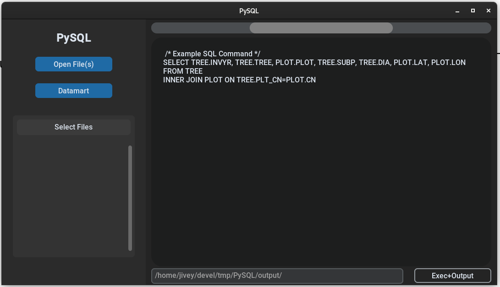

  <picture>
    
  </picture>

# PySQL
A python program made with CustomTkInter for the USDA-FIA so that state.db files can have sql commands ran on them. 

# Use
Download from [here](release/PySQL.exe) and run the file. Once you export a folder will appear called "output" with the result of your command.  

You will get warnings from google that it doesn't recognize this software and it might be a virus. You can check the code in [main.py](src/__main__.py)to verify that it isn't then hit *continue anyway*.

## Preview

| _What version 0.0.1 looks like_
###
Lots of **bugs** are likely still in the code as there is no error handling or input sanitzation. Or even any processing done on the SQL. In the future SQL parsing, syntax highlighting, line numbers, and error handling should be added. 

